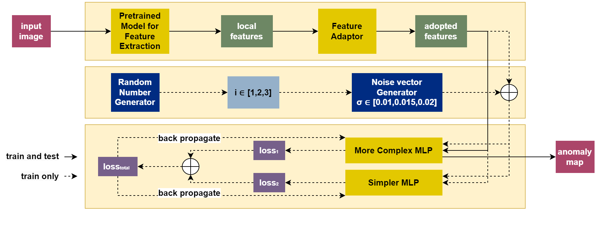
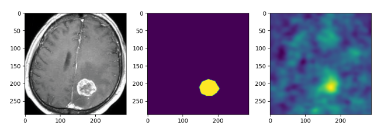

### Anomaly Detection and Localization with Synthesized Anomaly Features and Assisted MLP
Presented and Awarded at the Winter Conference of Society for Computational Design and Engineering (2024)

### Model

### Visualizations for the MVTec dataset

### Visualization for the Br35H dataset

*This implementation is based on the codes from [PatchCore](https://github.com/amazon-science/patchcore-inspection) and [SimpleNet](https://github.com/DonaldRR/SimpleNet). Modifications have been made for the purposes stated in the [paper](https://baharav.github.io/files/CDE2024.pdf).*